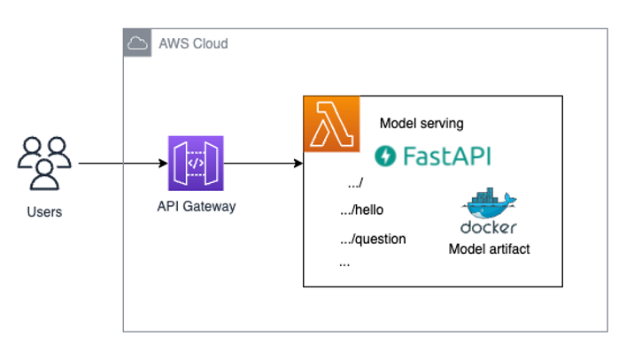
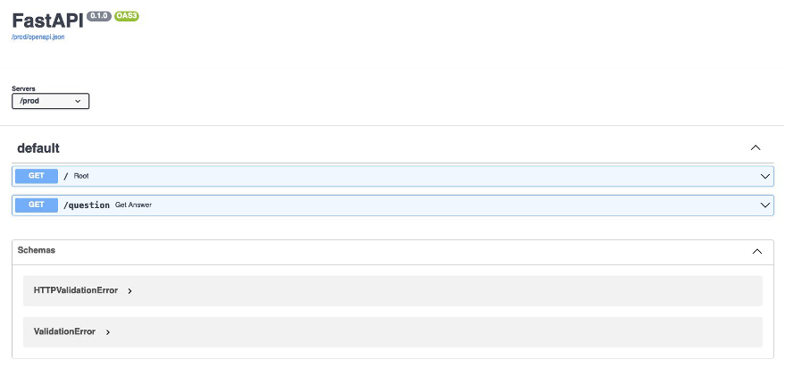

# NextJS Persian TTS App
This is the backend of my NextJs app, uploaded here for reference.
## Architecture



## FastAPI project structure using AWS CDK

We are using the following directory structure for the project (ignoring some boilerplate cdk code that is immaterial):

```
fastapi_model_serving
│   
└───.venv  
│
└───fastapi_model_serving
│   │   __init__.py
│   │   fastapi_model_serving_stack.py
│   │   
│   └───model_endpoint  
│       └───docker
│       │      Dockerfile
│       │      serving_api.tar.gz
│       │  
│       └───runtime
│            └───serving_api
│                    requirements.txt  
│                    serving_api.py
│                └───custom_lambda_utils
│                     └───model_artifacts
│                            ...
│                     └───scripts
│                            inference.py
│  
└───templates
│   └───api
│   │     api.py    
│   └───dummy
│         dummy.py
|
└───scripts
│   └───init-lambda-code.sh
│   └───setup.sh
│   └───update_notice.sh
│      
│   app.py
│   cdk.json
│   README.md
│   requirements.txt
 
```
## Relevant Commands:

1) This step will download the pretrained model that will be deployed from the huggingface model hub into the `./model_endpoint/runtime/serving_api/custom_lambda_utils/model_artifacts` directory. It will also create a virtual environment and install all dependencies that are needed. You only need to run this command once:
```shell 
make prep
```
2) The model artifacts need to be packaged inside a .tar.gz archive that will be used inside the docker image that is built in the cdk stack. You will need to run this code whenever you make changes to the model artifacts or the API itself to always have the most up-to-date version of your serving endpoint packaged:
```shell
make package_model
```

3) Since we are building docker images locally in this cdk deployment, we need to ensure that the docker daemon is running before we are going to be able to deploy this stack via the cdk CLI. To check whether or not the docker daemon is running on your system, use the following command:
```shell
docker ps
```

6) Deploy the solution with the following command:
```shell
make deploy
```
This step can take around **5-10 minutes** due to building and pushing the docker image.

### Using the API documentation in the browser
The Swagger UI documentation can be found at /docs:

